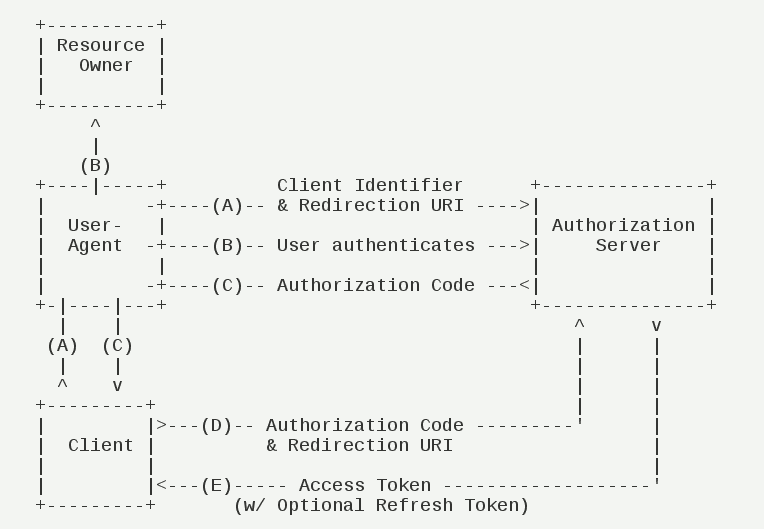

# oauth2-provider

OAuth是一个关于授权（authorization）的开放网络标准，允许用户让第三方应用访问该用户在某一网站上存储的私密的资源（如照片，视频，联系人列表），而无需将用户名和密码提供给第三方应用。目前流行的版本是2.0版。

## 认证授权过程

### 在认证和授权的过程中涉及的三方包括：
1. 服务提供方，用户使用服务提供方来存储受保护的资源，如照片，视频，联系人列表。
2. 用户，存放在服务提供方的受保护的资源的拥有者。
3. 客户端，要访问服务提供方资源的第三方应用，通常是网站，如提供照片打印服务的网站。在认证过程之前，客户端要向服务提供者申请客户端标识。

## 客户端授权模式:
客户端必须得到用户的授权（authorization grant），才能获得令牌（access token）。OAuth 2.0定义了四种授权方式。
1. 授权码模式（authorization code）
2. 简化模式（implicit）
3. 密码模式（resource owner password credentials）
4. 客户端模式（client credentials）

## 授权码模式：
授权码模式（authorization code）是功能最完整、流程最严密的授权模式。它的特点就是通过客户端的后台服务器，与"服务提供商"的认证服务器进行互动。

步骤如下：
1. 用户访问客户端，后者将前者导向认证服务器。
2. 用户选择是否给予客户端授权。
3. 假设用户给予授权，认证服务器将用户导向客户端事先指定的"重定向URI"（redirection URI），同时附上一个授权码。
4. 客户端收到授权码，附上早先的"重定向URI"，向认证服务器申请令牌。这一步是在客户端的后台的服务器上完成的，对用户不可见。
5. 认证服务器核对了授权码和重定向URI，确认无误后，向客户端发送访问令牌（access token）和更新令牌（refresh token）。